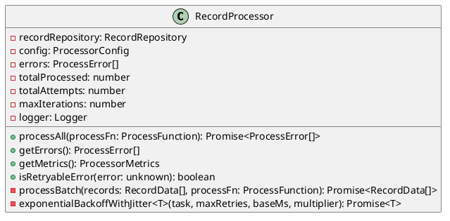
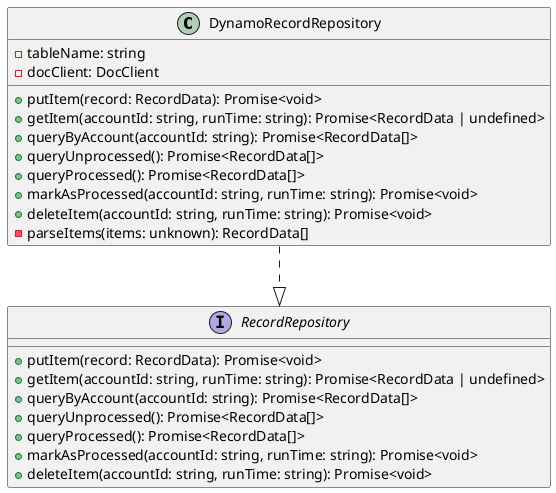
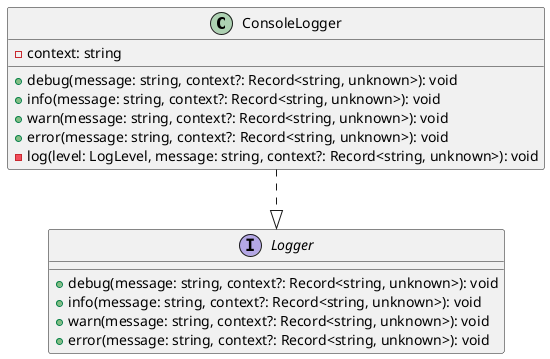
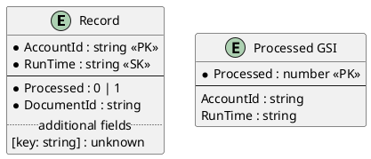
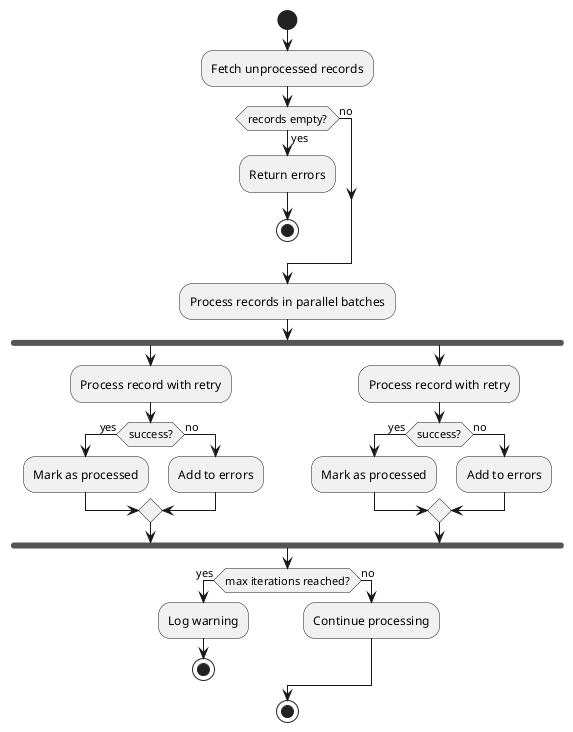

# Architecture

**Date Created**: 2026-02-18
**Last Modified**: 2026-02-18
**Version**: v1.0

## Overview

This project provides a TypeScript library for processing DynamoDB records with parallel execution, error handling, and dependency injection support.

## System Diagram

```plantuml
@startuml
package "External" {
  [DynamoDB Local] as DynamoDB
}

package "tsys-record-processing" {
  package "Services" {
    [RecordProcessor] as Processor
    [Logger] as Logger
    [DynamoDB Client] as Client
  }
  
  package "Models" {
    [DynamoRecordRepository] as Repository
    [RecordSchema] as Schema
  }
  
  package "Types" {
    [Interfaces] as Types
  }
  
  package "Utils" {
    [Config] as Config
    [ProcessorConfig] as PConfig
  }
}

Processor --> Repository : uses
Processor --> Logger : uses
Processor --> PConfig : config
Repository --> Client : uses
Repository --> Schema : validates
Client --> DynamoDB : connects
Logger --> Types : implements
Repository --> Types : implements
@enduml
```

## Component Architecture

### RecordProcessor

The core processing engine that handles parallel record processing.



**Responsibilities:**
- Fetch unprocessed records from repository
- Process records in parallel batches
- Handle errors with exponential back-off and jitter
- Track processing metrics
- Prevent infinite loops with max iterations

### DynamoRecordRepository

Data access layer for DynamoDB record operations.



**Responsibilities:**
- CRUD operations for records
- Query records by account
- Query records by processed status using GSI
- Validate records using Zod schema

### Logger

Structured JSON logging service.



**Responsibilities:**
- Structured JSON logging
- Context-aware messages
- Consistent timestamp format

## Data Model

### Record



**Schema Validation (Zod):**
```typescript
const RecordSchema = z.object({
  AccountId: z.string().min(1),
  RunTime: z.string().min(1),
  Processed: z.union([z.literal(0), z.literal(1)]),
  DocumentId: z.string().min(1),
});
```

## Processing Flow



## Dependency Injection

All components support dependency injection for testability:

```typescript
// Production usage
const processor = new RecordProcessor({
  recordRepository: new DynamoRecordRepository(),
  logger: createLogger("RecordProcessor"),
  config: { maxWorkers: 5, maxRetries: 3, backoffBaseMs: 100, backoffMultiplier: 2 },
});

// Test usage with mocks
const mockRepository = { queryUnprocessed: vi.fn(), ... };
const mockLogger = { debug: vi.fn(), info: vi.fn(), ... };
const processor = new RecordProcessor({
  recordRepository: mockRepository,
  logger: mockLogger,
  config: { maxWorkers: 1, maxRetries: 0, backoffBaseMs: 1, backoffMultiplier: 1 },
});
```

## Error Handling

### Retryable Errors

The processor automatically retries errors that are considered retryable:
- Connection timeouts
- Service unavailable
- Throttling errors

### Non-Retryable Errors

These errors are not retried:
- Validation errors
- Malformed data
- Unauthorized/Forbidden
- Resource not found
- Conditional check failed

### Exponential Back-off with Jitter

```
delay = baseMs * (multiplier ^ attempt) + random_jitter
```

This prevents thundering herd problems when multiple workers retry simultaneously.

## Configuration

### Environment Variables

| Variable | Default | Description |
|----------|---------|-------------|
| DYNAMODB_ENDPOINT | http://localhost:8000 | DynamoDB endpoint |
| AWS_REGION | us-east-1 | AWS region |
| AWS_ACCESS_KEY_ID | local | AWS access key |
| AWS_SECRET_ACCESS_KEY | local | AWS secret key |
| RECORD_TABLE | TSYSAdd | Record table name |

### Processor Configuration

| Option | Default | Description |
|--------|---------|-------------|
| maxWorkers | 5 | Parallel workers |
| maxRetries | 3 | Max retry attempts |
| backoffBaseMs | 100 | Base back-off delay |
| backoffMultiplier | 2 | Back-off multiplier |
| maxIterations | 10 | Max processing loops |

## Testing Strategy

- **Unit Tests**: All modules have co-located tests in `__tests__` directories
- **Mocking**: Dependencies are injected for easy mocking with Vitest
- **Coverage**: Target 100% code coverage

## Security Considerations

- Credentials are read from environment variables, never hardcoded
- `.env` is excluded from version control
- Input validation with Zod prevents malformed data
- Error messages are sanitized before logging
